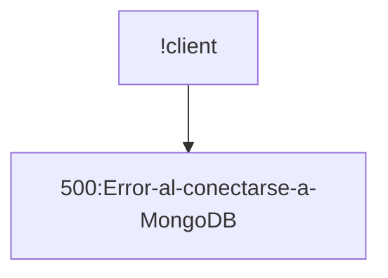
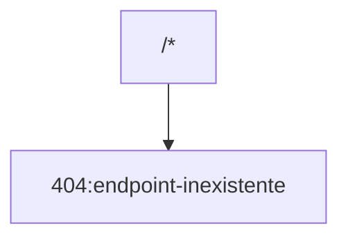
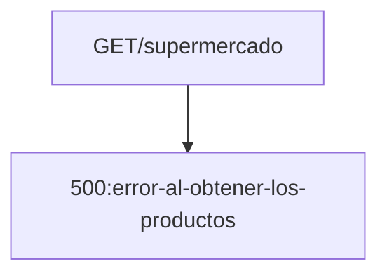
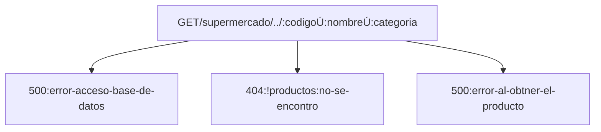
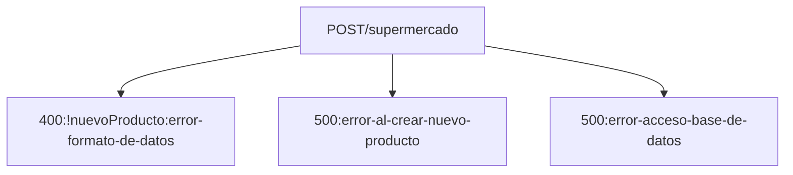
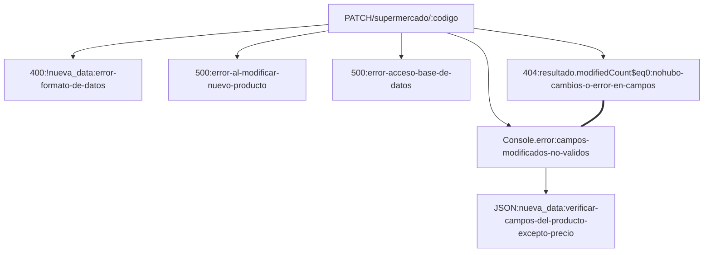

<!-- La misma, deberá incluir los siguientes puntos:
1. Construir una introducción al proyecto backend de frutas:
a. debes detallar al inicio de la documentación la URL base http://localhost:3008/api/v1/
b. deberás crear un ejemplo de uso de cada uno de los métodos GET - POST - PUT - DELETE
c. incluye un ejemplo de código del cuerpo del mensaje para los métodos POST - PUT
d. no incluyas el método PATCH si es que lo construiste oportunamente
e. incluye un ejemplo del archivo .env para explicar cómo definir la conexión a MongoDB
f. no es necesario incluir el nivel de seguridad de la API vía JWT
1. debes integrar en la creación de esta documentación:
a. títulos y subtítulos, más formateo estándar de párrafos con Markdown
b. integrar un sumario en el encabezado del documento Markdown
c. una tabla general que represente los endpoint a utilizar y la ruta base de cada uno
d. utilizar el formato código, para representar los bloques de código de ejemplo
e. al menos un gráfico construído con Markdown, en la sección que consideres apropiada
1. postear todo en Github de forma pública. Compartir el link de acceso a tu trabajo práctico.  -->

# URL BASE

> PORT ----  por defecto 3008 || 3000

### http//:localhost:3008/api/peliculas
>para control de tablas catalogo de peliculas
### http//:localhost:3008/api/peliculas/vistas
>para control de las vistas SQL
### http//:localhost:3008/api/peliculas/poster
>para control de la plantilla EJS para visualizar posters en el
>navegador


# SUMARIO

- [URL BASE](#url-base)
    - [http//:localhost:3008/api/peliculas](#httplocalhost3008apipeliculas)
    - [http//:localhost:3008/api/peliculas/vistas](#httplocalhost3008apipeliculasvistas)
    - [http//:localhost:3008/api/peliculas/poster](#httplocalhost3008apipeliculasposter)
- [SUMARIO](#sumario)
  - [Introduccion](#introduccion)
  - [EndPoints](#endpoints)
    - [catalogo](#catalogo)
    - [vistas](#vistas)
    - [EJS](#ejs)
  - [Codigos de PUT y POST](#codigos-de-put-y-post)
  - [Variables de Entorno (.Env)](#variables-de-entorno-env)
  - [Configuracion Acceso a MySQL](#configuracion-acceso-a-mysql)
  - [Asociaciones de SEQUELIZE](#asociaciones-de-sequelize)
  - [Mensajes de Error](#mensajes-de-error)


## Introduccion

Es una API CRUD con integracion de MySQL en un proyecto Node.js. Tambien utiliza ORM Sequelize y plantillas HTML estaticas con EJS. Proporciona respuestas con recursos en formato JSON. Permite agregar , modificar o eliminar recursos. Posee Vistas SQL.

Se utiliza con una base de datos d peliculas (trailerflix) proporcionada por la institucion Academica ***UNTREF*** y ***ARGENTINA PROGRAMA 4.0***.

## EndPoints

### catalogo

|PETICION |URL |DESCRIPCION|
--- | --- | ---|
|GET|http://localhost:3008/|ruta raiz . Devuelve msj de bienvenida|
|GET|http://localhost:3008/api/peliculas|/Ruta para LISTAR todas las peliculas|
|GET|http://localhost:3008/api/peliculas/:id|Ruta para BUSCAR una pelicula por su ID|
|GET|http://localhost:3008/api/peliculas/genero/:genero|Ruta para BUSCAR peliculas por GENERO.|
|GET|http://localhost:3008/api/peliculas/categoria/:categoria|Ruta para BUSCAR pliculas por CATEGORIA|
|GET|http://localhost:3008/api/peliculas/titulo/:titulo|modificar el precio de un producto. Solo podrás modificar el precio del producto, no sus otros parámetros|
|POST|http://localhost:3008/api/peliculas|AGREGA una pelicula al catalogo|
|PUT|http://localhost:3008/api/peliculas/update/:id|Ruta para UPDATE una pelicula por su ID|
|DELETE|http://localhost:3008/api/peliculas/:id|Ruta para ELIMINAR una pelicula por su ID|

### vistas

|PETICION |URL |DESCRIPCION|
--- | --- | ---|
|GET|http://localhost:3008/api/peliculas/vistas/peliculaygeneros|VISTA SQL que muestra un INNER JOIN de peliculas y generos . Utilza la tabla intermedia pelicula_genero.|
|GET|http://localhost:3008/api/peliculas/vistas/peliculayactores|VISTA SQL que muestra un INNER JOIN de peliculas y actores . Utilza la tabla intermedia pelicula_actor.|

### EJS

|PETICION |URL |DESCRIPCION|
--- | --- | ---|
|GET|http://localhost:3008/peliculas/poster|Plantilla EJS para visualizar Titulo, Reparto y Posters . Ver en el navegador |


Formato de las PELICULAS en la Base de Datos en formato Json :

```json
{
      "id": 3,
      "poster": "icono1.png",
      "titulo": "The Mandalorian",
      "categoria": "Serie",
      "genero": "Ciencia Ficción, Fantasía",
      "resumen": "Ambientada tras la caída del Imperio y antes de la aparición de la Primera Orden, la serie sigue los pasos de un pistolero solitario en las aventuras que protagoniza en los confines de la galaxia, donde no alcanza la autoridad de la Nueva República.",
      "temporadas": 2,
      "reparto": "Pedro Pascal, Carl Weathers, Misty Rosas, Chris Bartlett, Rio Hackford, Giancarlo Esposito",
      "trailer": "https://www.youtube.com/embed/aOC8E8z_ifw"
   },
```

>Ejemplo PATCH : 
>>si se envia la peticion PATCH y se modificaron los campos invalidos :
>>>No se pudo modificar o no hubo cambios.
>>>Verificar campos modificados
>>>Ver error en el log
>>>Status: 404 Not Found Size: 88 Bytes Time: 1.25 s
>
>
>>>NO se pueden modificar estos campos
>>>codigo|nombre|categoria : 9012 | Detergente | Limpieza
>>>Desconectado de MongoDB

## Codigos de PUT y POST
```javascript

//server.js

peliculasRouter=require("./src/routers/peliculasRouter");
app.use("/api",peliculasRouter);


//peliculasRouter.js

const peliculasControlador = require('../controladores/control_pelicula');

router.post("/peliculas", peliculasControlador.crearPelicula);

router.put("/peliculas/update/:id",peliculasControlador.actualizarPelicula);

//control_peliculas.js

//POST PARA CREAR PELICULA

const crearPelicula=async (req, res) => {
  
            try {
          
              const poster  =req.body.poster;
              const titulo =req.body.titulo;
              const categoria  =req.body.categoria;
              const genero  =req.body.genero;
              const resumen  =req.body.resumen;
              const temporadas =req.body.temporadas;
              const reparto =req.body.reparto;
              const trailer=req.body.trailer;
          
              const nuevaPelicula= await peliculasTabla.create({poster,titulo,categoria,genero,resumen,temporadas,reparto,trailer});
          
              let actoresNuevaPelicula=nuevaPelicula.reparto;
              let generosNuevaPelicula=nuevaPelicula.genero;
              let categoriaNuevaPelicula=nuevaPelicula.categoria;
          
              let actoresNuevaPeliculaSplit=actoresNuevaPelicula.split(",");
              console.log(`Reparto de la Pelicula :${actoresNuevaPeliculaSplit}`);
          
              let generosNuevaPeliculaSplit=generosNuevaPelicula.split(",");
              console.log(`Generos de la Pelicula :${generosNuevaPeliculaSplit}`);
          
              let categoriaNuevaPeliculaSplit=categoriaNuevaPelicula.split(",");
              console.log(`Categoria de la Pelicula :${categoriaNuevaPeliculaSplit}`);

              agregarActoresAPeliculas(actoresNuevaPeliculaSplit,nuevaPelicula);
              agregarGenerosAPeliculas(generosNuevaPeliculaSplit,nuevaPelicula);
              agregarCategoriaAPeliculas(categoriaNuevaPeliculaSplit,nuevaPelicula);


              
            
          res.status(201).json(nuevaPelicula);
          
            } catch (error) {
          
              console.log('Error al crear el elemento',error);
              res.status(500).send("Error al intentar agregar un nuevo elemento");
            } finally {
          
            }
          };


// PUT PARA ACTUALIZAR EL ITEM POR ID          

const actualizarPelicula=async (req, res) => {
  
  try {
    
    const idPelicula=req.params.id;
    const poster  =req.body.poster;
    const titulo =req.body.titulo;
    const categoria  =req.body.categoria;
    const genero  =req.body.genero;
    const resumen  =req.body.resumen;
    const temporadas =req.body.temporadas;
    const reparto =req.body.reparto;
    const trailer=req.body.trailer;

    const buscarPelicula=await peliculasTabla.findByPk(req.params.id);
    
    let actoresNuevaPelicula=reparto;
    let generosNuevaPelicula=genero;
    let categoriaNuevaPelicula=categoria;

    let actoresNuevaPeliculaSplit=actoresNuevaPelicula.split(",");
    console.log(`Nuevo reparto de la Pelicula :${actoresNuevaPeliculaSplit}`);

    let generosNuevaPeliculaSplit=generosNuevaPelicula.split(",");
    console.log(`Nuevos generos de la Pelicula :${generosNuevaPeliculaSplit}`);

    let categoriaNuevaPeliculaSplit=categoriaNuevaPelicula.split(",");
    console.log(`Nuevas categorias de la Pelicula :${categoriaNuevaPeliculaSplit}`);

    for(let item of actoresNuevaPeliculaSplit){
      let buscarActor=await ActorPelicula.findOne({where: {nombre : item}})
        if (buscarActor==null){
            let nuevoActorCrear=await ActorPelicula.create({nombre:item});
            console.log(`Se creó actor ${nuevoActorCrear.nombre}.`)
        }else{
            console.log(`El actor ${buscarActor.nombre} ya existe.`)
          }};
    
for(let item of generosNuevaPeliculaSplit){  
      let buscarGenero=await GeneroPelicula.findOne({where: {nombre : item}})
        if (buscarGenero==null){
                  let nuevoGeneroCrear=await GeneroPelicula.create({nombre:item});
                  console.log(`Se creó actor ${nuevoGeneroCrear.nombre}.`)
              }else{
                  console.log(`El actor ${buscarGenero.nombre} ya existe.`)
                }
            }

for(let item of categoriaNuevaPeliculaSplit){
      let buscarCategoria=await CategoriaPelicula.findOne({where: {nombre : item}})
                if (buscarCategoria==null){
                    let nuevoCategoriaCrear=await CategoriaPelicula.create({nombre:item});
                    console.log(`Se creó categoria ${nuevoCategoriaCrear.nombre}.`)
                }else{
                    console.log(`La categoria ${buscarCategoria.nombre} ya existe.`)
                  }
              }


// EJEMPLO DE FUNCION PARA AGREGAR ACTORES Y UTILIZANDO LOS METODOS DE SEQUELIZE PARA ASOCIACIONES DE TABLAS

async function agregarActoresAPeliculas(lista,nuevaPelicula){

  for(let item of lista){
      
      
      let buscarActor=await ActorPelicula.findOne({where: {nombre : item}})
      
        if (buscarActor==null){
            let nuevoActorCrear=await ActorPelicula.create({nombre:item});
            await nuevaPelicula.addActorPelicula(nuevoActorCrear);
            console.log(`Se creó actor ${nuevoActorCrear.nombre}. Se relaciona a la pelicula ${nuevaPelicula.idPelicula} `)
        }else{
            await nuevaPelicula.addActorPelicula(buscarActor);
            console.log(`El actor ${buscarActor.nombre} ya existe. Se relaciona a la pelicula ${nuevaPelicula.idPelicula} `)
          }
      }
    };

```

## Variables de Entorno (.Env)

```javascript
PORT=3008

PORTSQL=3306
DATABASE="pruebas_trailerflix"
HOST='localhost'
USUARIO='root'
PASSWORD='tu_contraseña'
```

Utiliza   ***DATABASE*** para modificar la base de datos a la que acceder

>crea un archivo .env en la raiz de tu Proyecto y agrega tus variables


## Configuracion Acceso a MySQL

```Javascript
const sequelize=new Sequelize(process.env.DATABASE,process.env.USUARIO,process.env.PASSWORD,{
  host:process.env.HOST,
  port:process.env.PORTSQL,
  dialect:'mysql',
  dialectOptions:{
    options:{encrypt:true},
    multiplestatements: true //para poder utilizar raw queries
  },
  define:{timestamps:false},
  pool: {
    max: 3, // Máximo de conexiones en el grupo
    min: 0, // Mínimo de conexiones en el grupo
    acquire: 30000, // Tiempo máximo, para liberar conexiones inactivas
    idle: 10000, // Tiempo máximo para cerrar conexiones inactivas
  },
});

```


## Asociaciones de SEQUELIZE

```Javascript
//Asociaciones Has Many - Una categoria tiene muchas peliculas. Una plicula tiene una categoria
CategoriaPelicula.hasMany(peliculasTabla,{foreignKey:'categoria_ID'});
peliculasTabla.belongsTo(CategoriaPelicula,{foreignKey:'categoria_ID'});

//Asociaiones Many-to-Many relacionales
GeneroPelicula.belongsToMany(peliculasTabla, { through: 'pelicula_genero' });
peliculasTabla.belongsToMany(GeneroPelicula, { through: 'pelicula_genero' });
peliculasTabla.belongsToMany(ActorPelicula, { through: 'pelicula_actor' });
ActorPelicula.belongsToMany(peliculasTabla, { through: 'pelicula_actor' });
```

## Mensajes de Error












